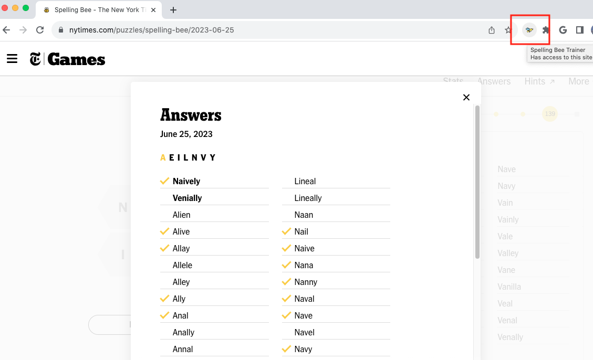

#  Spelling Bee Trainer

A Chrome Extension that helps you learn the words you miss in the NYT Spelling Bee game.

## Features

- Get the definitions for words you would like to study. Words are separated by those you found in a game and those you failed to find.
- Planned: Vocab game - learn words via fill in the blank

## Install

[**Chrome** extension]()

## How to use

1. Open up a Spelling Bee game from a previous day. 
2. Reveal the answers 
3. With the answers shown click on the extension button. This will open a new tab with the application.

## Contribution

Suggestions and pull requests are welcomed!.

---

This project was bootstrapped with [Chrome Extension CLI](https://github.com/dutiyesh/chrome-extension-cli)

Bee Emoji designed by [OpenMoji](https://openmoji.org/) – the open-source emoji and icon project. License: [CC BY-SA 4.0](https://creativecommons.org/licenses/by-sa/4.0/#)

